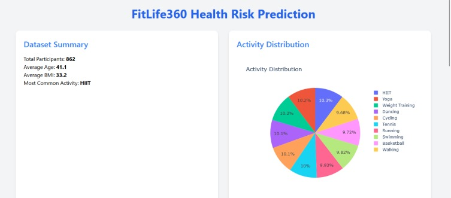
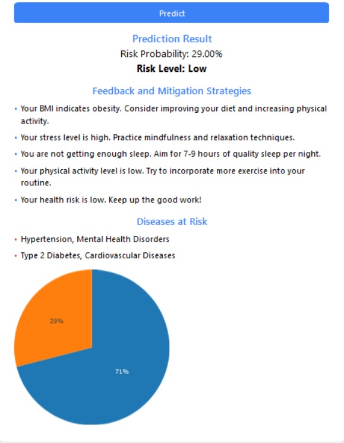

# FitLife360 Health Risk Prediction & Analytics Dashboard

## 📌 Project Overview
*FitLife360* is a Flask-based web application that predicts individual health risks using biometric and lifestyle data. It employs machine learning to assess user risk and delivers actionable feedback through an interactive dashboard.

### 🧠 My Contributions
Developed the entire system, including:
* Preprocessing and feature engineering of health data
* Training and evaluating ML models (Random Forest, Logistic Regression, Gradient Boosting)
* Building the Flask API backend
* Designing dashboards using Plotly and CSS
* Integrating real-time prediction and health feedback logic

## 🔍 Contributions Evidence

### 📊 Dashboard 

### 🧠 Prediction Form

## 🧪 Project Summary Table

| Sprint | Key Deliverables                                                 | Objective                       |
|--------|------------------------------------------------------------------|----------------------------------|
| 1      | Dataset ingestion, cleaning, BMI calculation                     | Data readiness, MVP setup       |
| 2      | Model training (RF, LR, GB), evaluation metrics                  | Risk prediction engine          |
| 3      | Flask endpoints and API integration                              | Functional backend              |
| 4      | Frontend design with Tailwind + Plotly                           | Dashboard and UI development    |
| 5      | Feedback rules, disease mapping, and response generation logic   | Insightful user interaction     |

---

## 🔖 User Stories / Task Summary

* As a user, I want to enter my health data and instantly receive a risk assessment.
* As a user, I want personalized health advice based on my lifestyle.
* As the developer, I implemented:
  - All model training and evaluation logic
  - Flask-based REST API endpoints (/predict, /dashboard)
  - Frontend dashboard using HTML + CSS + Plotly
  - Health risk rules and prediction feedback engine

---

### Code Repository
GitHub: [https://github.com/Sowmyaakula1/Health_Risk_Predictor](https://github.com/Sowmyaakula1/Health_Risk_Predictor)

### Commit History
All code commits under [@Sowmyaakula1](https://github.com/Sowmyaakula1)

---

## 📚 Appendix

* Trained model file: trained_models.pkl
* Dataset: health_fitness_dataset.csv
* Flask templates: index.html, dashboard.html
* Plotly used for interactive visualization
* CSS for clean UI layout

---
